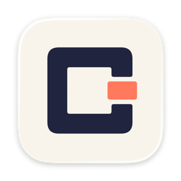
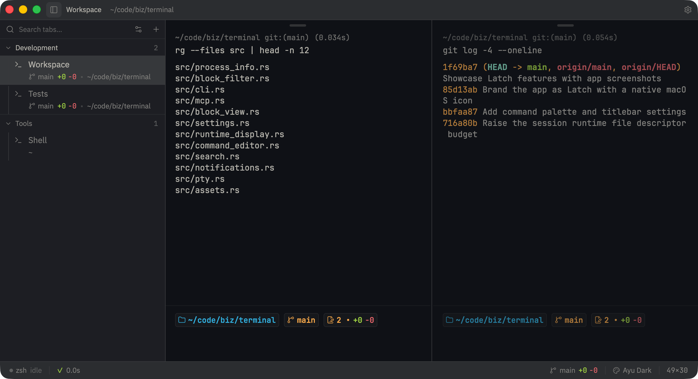
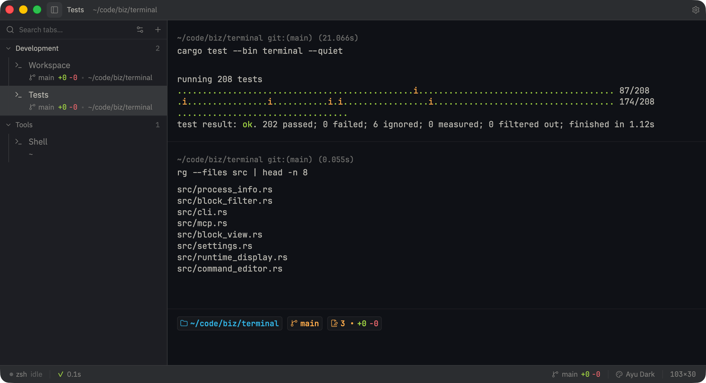
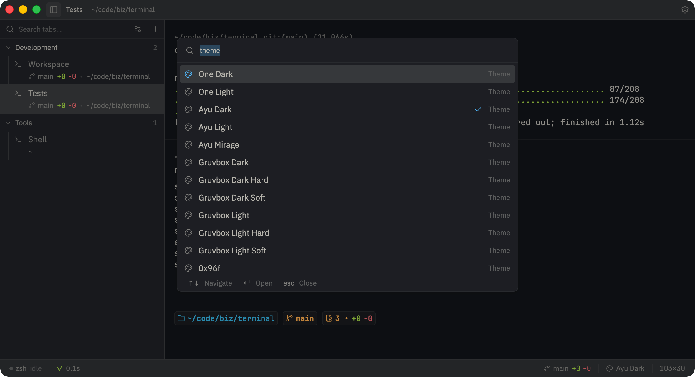
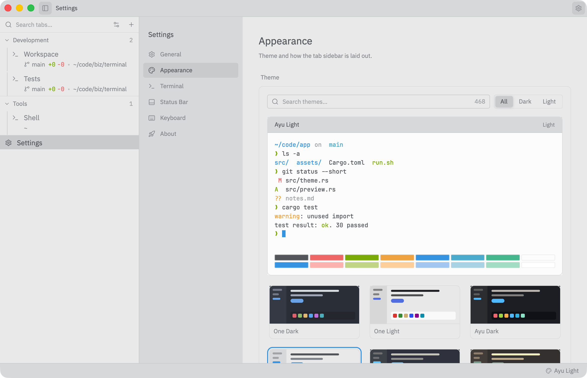

<p align="center">
  
</p>
<h1 align="center">Latch</h1>
<p align="center">A native macOS terminal with persistent sessions, command blocks, and coding agents.</p>
<p align="center">
  <a href="https://github.com/rmonvfer/latch/releases/latest">Download</a> · <a href="#building">Build</a> · <a href="#sessions">Sessions</a> · <a href="#driving-it-from-outside">CLI &amp; MCP</a>
</p>



A macOS terminal built on [GPUI](https://github.com/zed-industries/zed) (Zed's UI framework) and [libghostty-vt](https://github.com/uzaaft/libghostty-rs) (Ghostty's terminal emulation, as a library). Ghostty parses the bytes and GPUI draws the grid. Everything around those two parts is written here: tabs, a block view of commands, an input editor, and sessions that keep running when the window closes.

It's early and macOS only.

## Installing

[Production releases](https://github.com/rmonvfer/latch/releases/latest) include macOS ZIPs for Apple Silicon (`arm64`) and Intel (`x86_64`), with SHA-256 checksums. Unzip the matching download and move `Latch.app` to Applications. Keep the bundle at the same location across upgrades so its session runtime can reconnect. Releases are signed with an Apple Developer ID certificate; the release notes state whether Apple notarization is included.

[Beta releases](https://github.com/rmonvfer/latch/releases) are marked as prereleases. They use the same settings and sessions as production, so install one channel at a time.

## Your workspace

Split panes horizontally or vertically, resize them, and zoom into one pane when you need the space. Group and pin tabs in the sidebar, give them names, colors, and icons, and see each shell’s directory, git branch, and changes without switching tabs.

Agent profiles launch Claude Code, Codex, Gemini, Aider, or OpenCode in a pane. Optional git worktrees keep their work separate, and activity indicators help you find sessions that need attention.

| Action | Shortcut |
| --- | --- |
| Split right / down | ⌘D / ⌘⇧D |
| Focus a neighboring pane | ⌘⌥ + arrow |
| Zoom the focused pane | ⌘⇧Enter |
| Equalize panes | ⌘⌃= |
| Toggle sidebar | ⌘B |
| Command palette | ⌘K |
| Settings | ⌘, |

## Sessions

Shells don't belong to the window. The first launch starts a session runtime, a background copy of the same binary run with `--session-runtime`. The runtime owns every PTY and its Ghostty terminal. The app connects over a Unix socket and draws whatever the runtime sends. If you quit the app, the shells keep running, and opening it again reattaches them.

If the runtime itself goes away (a reboot, a crash, a new build), each pane starts a fresh shell in its last working directory. Claude Code and Codex sessions also come back if they were set up to report their session ids:

```sh
terminal integrate claude
terminal integrate codex
```

Layout and session state are written to `~/.config/terminal/session.json`, with backups and rolling snapshots next to it. The safeguards and the agent resume approach follow [herdr](https://github.com/herdrdev/herdr) (Apache-2.0).

## Command blocks



In zsh with shell integration on, each command and its output become a block, and you type into an editor pinned to the bottom of the pane, as in Warp. The editor highlights syntax, suggests from your history as you type, and opens zsh's own completions on Tab. Ctrl-R searches history.

A block shows the directory, git branch, and duration above the command, and is tinted red if the command failed. Click to select a block, ⌘-click to add another, ⇧-click to select a range. ⌘C copies the selected blocks. The ⋯ menu on each block has the rest: copy the command or output, filter the output by text or regex (with context lines), find within the block, bookmark, rerun.

Full-screen programs such as vim, htop, or an agent that takes the alternate screen get the whole pane as a normal terminal. Bash gets shell integration (working directory, prompt marks) but not blocks yet.

## Command palette



⌘K opens a palette over the window that searches open tabs, commands, and themes in one list. It only offers commands that apply to whatever had focus, shows their shortcuts, and runs them against that pane. Typing `theme` narrows it to themes. Clear Scrollback is on ⌘⇧K.

## Driving it from outside

The `terminal` binary is also a CLI for the running app. It talks to a control socket in the config directory:

```sh
terminal new --name logs -- tail -f /var/log/system.log
terminal send --tab 3 --enter "make test"
terminal read --tab 3 -n 20
```

`terminal mcp` serves the same API over MCP on stdio, so an agent can open tabs, type into panes, and read their output. Settings has a switch to turn the control socket off.

## Settings and themes



Settings live in `~/.config/terminal/settings.json` and are edited from the app's settings page (⌘,). The bundled themes are One, Ayu, and Gruvbox, each with light and dark variants. Latch also loads installed Ghostty themes and custom themes from the config directory. The bundled theme licenses are in `assets/themes/LICENSES`.

## Building

You need Rust (pinned in `rust-toolchain.toml`), Zig 0.15, and Apple's Metal toolchain. Zig has to be exactly 0.15: the Ghostty source that libghostty-vt pins checks the major and minor version, and use the versioned formula rather than Homebrew’s default `zig`.

```sh
brew install zig@0.15
xcodebuild -downloadComponent MetalToolchain
PATH="$(brew --prefix zig@0.15)/bin:$PATH" cargo build
./target/debug/terminal
```

`.cargo/config.toml` builds Ghostty's Zig core with `ReleaseFast` even in dev builds. In Debug mode, parsing terminal output is dozens of times slower.

Notifications only show up when the app runs from a bundle. `script/bundle-mac` builds `target/release/Latch.app`, or a debug bundle with `--debug`. Keep its bundle location stable because the session runtime authenticates connections by executable path. The script uses the available Developer ID certificate, or an ad-hoc signature when none is installed. Set `LATCH_SIGNING_IDENTITY` to select a certificate, or `-` for ad-hoc signing; `LATCH_SIGNING_KEYCHAIN` selects its keychain.

`script/package-mac v0.1.1` builds a release ZIP and checksum. Set `LATCH_NOTARY_PROFILE` to a stored `notarytool` credential profile to submit the app to Apple, staple its accepted ticket, and validate it before packaging. `LATCH_NOTARY_KEYCHAIN` selects the profile's keychain, and `LATCH_REQUIRE_NOTARIZATION=1` requires a profile.

## Releases

The [macOS release workflow](.github/workflows/release.yml) checks formatting, runs Clippy and tests, then builds native Apple Silicon and Intel bundles. A push to `dev` publishes a beta prerelease tagged `v<VERSION>-beta.<RUN_NUMBER>`. A push to `main` publishes `v<VERSION>` as the latest production release, where `VERSION` is the package version in `Cargo.toml`. Published versions are never moved to another commit; bump the version in both `Cargo.toml` and `Cargo.lock` for the next production release. Pull requests run the same checks and packaging without publishing.

Develop on `dev` and merge it into `main` to promote a version. The workflow creates tags at the built commit, uploads both ZIPs and their checksums to a draft release, and publishes only after both architecture builds succeed. Manual runs on either branch can retry a release; beta run numbers distinguish builds. Publishing requires the Developer ID signing credentials configured in the repository's Actions secrets. Pull requests use ad-hoc signatures.

## Profiling

Run with `TERMINAL_TRACE=1` and both the app and the runtime write Chrome-format traces to `~/.config/terminal/traces/`. Open them in [ui.perfetto.dev](https://ui.perfetto.dev).

Benchmarks are kept as ignored tests:

```sh
cargo test --release benchmark -- --ignored --nocapture
```

## License

Apache-2.0. See [LICENSE](LICENSE).
